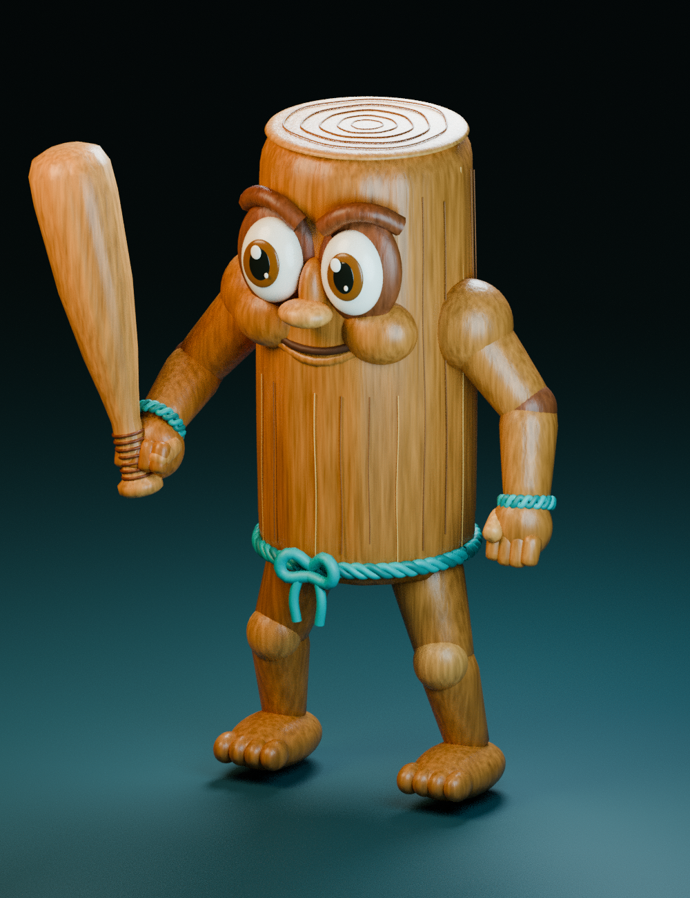

# Модель Тун Тун Сахура

`Sahur.rbxm` — игровой 3D-шаблон с геометрией, встроенной в файл модели.
`Sahur.rbxmx` содержит тот же шаблон в XML для проверки и редактирования.
Высокополигональная геометрия хранится в скрытых данных `UnionOperation`.
Плагин Rojo не может записать эти данные через API Studio, поэтому модель
нужно один раз импортировать из файла. Прямая синхронизация такого шаблона
создала бы детали без геометрии.

## Установка в существующую игру

1. Получи обновление репозитория и останови Play в Studio.
2. В панели Rojo нажми **Disconnect**.
3. В Explorer раскрой `ReplicatedStorage → QuietCove → CreatureAssets`.
   Сохрани старую модель `sahur`, переместив её в `ServerStorage` и переименовав,
   например, в `sahur_backup`.
4. Выдели `CreatureAssets`, нажми правой кнопкой → **Insert from File…**
   и выбери `assets/creatures/Sahur.rbxm` из папки репозитория. Если Studio
   вставит модель в Workspace, перемести её в `CreatureAssets` вручную.
5. Убедись, что новая модель называется ровно `sahur` и находится прямо в
   `ReplicatedStorage.QuietCove.CreatureAssets`, без дополнительной папки.
   В Command Bar режима редактирования верни центр шаблона в начало координат:

   ```lua
   game.ReplicatedStorage.QuietCove.CreatureAssets.sahur:PivotTo(CFrame.new())
   ```

6. Сохрани игру. Перезапусти `rojo serve default.project.json`, подключись
   снова через панель Rojo и запусти Play.

Rojo сохраняет неизвестные модели в `CreatureAssets`, поэтому импортированная
геометрия останется на месте при дальнейшей синхронизации скриптов.
Существующая анимация появления улова автоматически использует новый шаблон.
PNG-портрет Сахура задаётся отдельно в `src/client/SahurArtData.luau`.

## Проверка появления

После запуска Play заверши рыбалку и закрой рюкзак или магазин.
В Command Bar выполни:

```lua
require(game.ReplicatedStorage.QuietCove.StudioPreview):World("sahur")
```

Команда показывает только 3D-появление Сахура из воды, без выдачи награды.
Полный просмотр появления и существующего PNG-портрета:

```lua
require(game.ReplicatedStorage.QuietCove.StudioPreview):Catch("sahur")
```

Просмотр доступен только в Roblox Studio после запуска Play. Остановить его:

```lua
require(game.ReplicatedStorage.QuietCove.StudioPreview):Stop()
```

Шаблон ориентирован лицом вдоль локальной оси −Z и расположен около начала
координат. При показе улова `CatchPresentation` масштабирует его до 5 studs по
самому большому размеру. Этот шаблон отвечает за внешний вид; здоровье,
преследование игрока и бой подключаются следующим этапом.

## Геометрия и исходники

В модели 117 276 треугольников, 106 видимых мешей, 14 частей рига и 13
суставов `Motor6D`. `AnimationController` и `Animator` предназначены для
будущих анимаций. Корневая часть закреплена для просмотра; декоративные
меши приварены к частям рига и не участвуют в столкновениях.



Это рендер той же геометрии в Blender. Освещение и шейдер дерева в Roblox
отличаются: игровой файл использует стандартные материалы Wood, Fabric
и SmoothPlastic. Фактический внешний вид окончательно проверяется в Studio.

Воспроизведение экспорта из корня репозитория:

```bash
blender --background --python tools/sahur/build_sahur.py -- --output-dir /tmp/sahur
python3 tools/sahur/build_model.py /tmp/sahur/geometry.json --binary assets/creatures/Sahur.rbxm
```

Первый шаг создаёт геометрию, `.blend`, FBX с арматурой и превью. Второй
собирает Roblox-модель и проверяет индексы, координаты, нормали и границы
мешей, затем выполняет бинарное/XML-преобразование через Lune. Для второго
шага Lune должен быть в PATH или задан параметром `--lune /путь/к/lune`.
